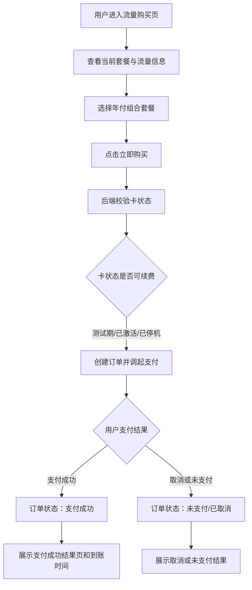
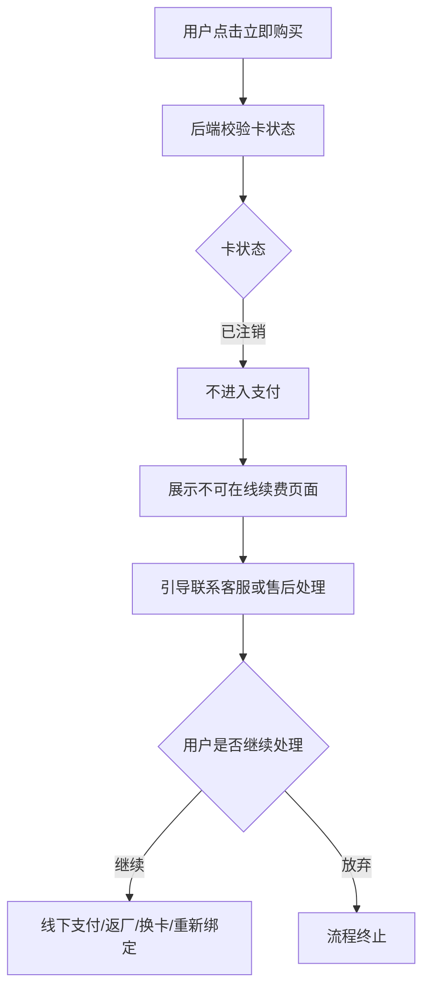
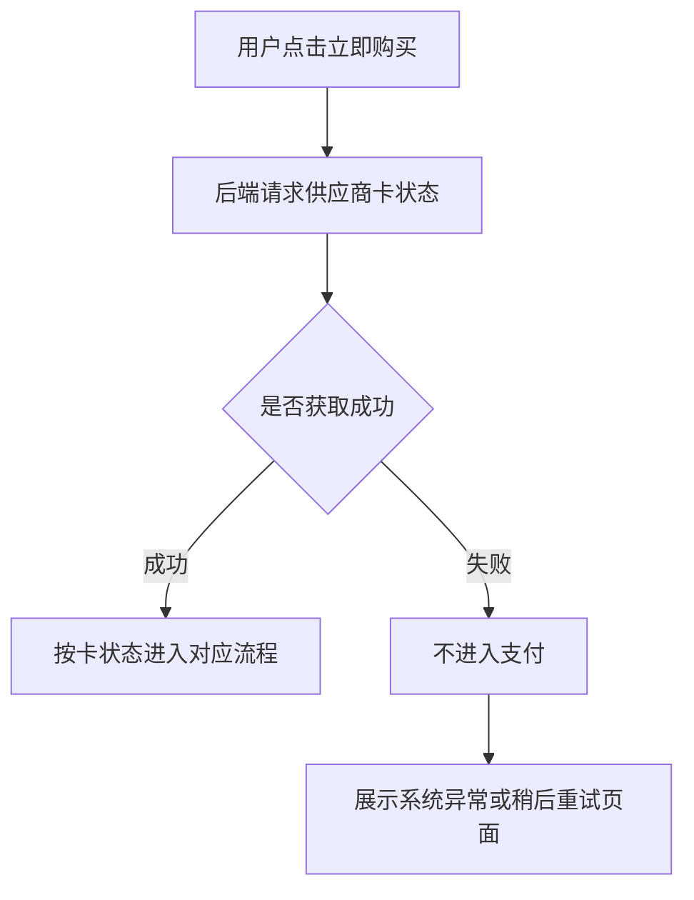

# 2026-07-02 流量套餐购买与续费需求评审会议纪要

## 一、会议信息

- 会议时间：2026 年 7 月 2 日 14:53
- 会议时长：1 小时 29 分 10 秒
- 会议主题：国内版 4G 流量与 AI 算力组合套餐购买/续费需求评审
- 资料来源：录音转写《新录音.txt》
- 说明：转写中大部分参会者以“说话人 X”标识，纪要按议题和职责归纳，不强行还原未识别姓名。

## 二、会议核心结论

1. 本期优先上线“4G 流量 + AI 算力组合套餐”的年付购买/续费能力。
2. 本期暂不拆分“单独流量”“单独 AI 算力”等套餐，原因是供应商当前只支持按年付费，且拆分 AI 算力权益的工程量和 ROI 不匹配。
3. 购买入口暂未最终确定，因为国内版整体交互和导航后续需要调整；本次评审主要确认购买内页、订单、支付、卡状态和异常路径。
4. 购买页不直接向用户展示底层卡状态，例如“已注销”等状态不放在主购买页显性展示。
5. 用户点击“立即购买”后，后端必须先校验卡状态，再进入支付流程，避免用户支付后才发现无法充值，从而引发退款和售后问题。
6. 订单状态先保持轻量化，不做电商式“待支付 15 分钟”状态。本期订单只保留“支付成功”和“未支付/已取消”两类用户可见结果。
7. 支付成功、支付取消、卡不可续费、系统异常等结果建议从 toast 改为独立结果页或明确落地页，减少用户错过提示后反复咨询客服。
8. 已停机但未注销的卡仍允许续费，但到账时间会比正常状态更久。
9. 已注销的卡无法在线续费，需要客服/售后兜底，初步方向是返厂更换实体贴片卡或由供应商/工厂完成新卡与设备重新绑定。
10. 虚拟产品充值后原则上不支持退款，需要在服务协议或购买说明中明确“一经充值不退款”等规则，并与法务/协议负责人确认措辞。
11. 国内版 UI 与海外版 UI 未来方向是逐步合并和统一，但本期不把 UI 重构放进流量购买需求里，避免 7 月 15 日前范围失控。
12. 海外版 COPPA/儿童保护家长验证流程本期先不开发；当前优先保证海外 App Store/Google 审核版本先闭环。

## 三、需求背景与目标

当前国内设备使用实体贴片卡提供 4G 联网能力。部分设备已经或即将出现流量/服务到期问题，业务需要在 App 内提供流量购买和续费入口，用户可以看到当前套餐、有效期、使用量，并完成年费套餐购买。

本次讨论的重点不是单纯页面展示，而是围绕以下问题形成可落地方案：

- 用户如何查看当前 4G 套餐和剩余流量。
- 用户如何购买新的年付组合套餐。
- 购买前如何处理不同卡状态，尤其是“已停机”“已注销”和接口异常。
- 支付成功、取消支付、不可续费等结果如何反馈给用户。
- 供应商是否支持超期后续费、保号、重新绑定和有效期补偿。
- 已经售出的旧设备因出厂激活导致有效期被提前消耗时如何补偿。
- 国内版当前页面与后续国内外 App 合并改版之间如何拆分边界。

## 四、本期功能范围

### 4.1 本期要做

- 流量购买页或续费页。
- 当前套餐信息展示。
- 当前流量使用情况展示。
- 年付组合套餐展示与购买。
- 支付前卡状态校验。
- 微信支付或其他支付方式对接，当前原型按微信支付理解。
- 购买记录页面。
- 支付结果页或结果状态反馈。
- 卡不可续费时的客服/售后引导页。
- 订单状态简化处理。

### 4.2 本期暂不做

- 多套餐体系。
- 月付套餐。
- 单独 AI 算力权益购买。
- 单独流量权益购买。
- 电商式待支付订单倒计时。
- 支付后复杂退款链路。
- 国内版整体 UI 重构。
- 国内外 App 代码与功能完全合并。
- 海外 COPPA/家长验证流程开发。

### 4.3 时间约束

会议中明确提到上海展前、7 月 15 日前需要优先把流量购买功能上线，因此本期应控制需求边界，先完成可用闭环。

## 五、页面与模块设计

### 5.1 页面入口

入口暂未定。原因是国内版整体交互后续会调整，尤其是导航栏、首页功能归位和“我的”页面结构。当前先确认内页能力，入口可在后续 UI/导航调整中落位。

### 5.2 当前套餐模块

页面第一部分展示用户当前流量套餐信息，主要包含：

- 当前套餐名称。
- 套餐有效期。
- 本月已用流量。
- 本月剩余流量。
- 数据查询时间。

这些数据应从供应商 API 获取。页面需要向用户传达数据有查询时间，避免用户把接口延迟理解为实时错误。

### 5.3 套餐购买模块

当前原型展示多个套餐位，但本期只做第一个套餐，即：

- 4G 流量 + AI 算力组合套餐。
- 年付。
- 供应商侧按年付费。

文案上需要让用户知道价格中包含两个权益：4G 流量与 AI 算力。会议中提到竞品年费可能有 39.9 元、69.9 元等更低价格，因此“组合权益”的表达对用户认知比较重要。

### 5.4 购买记录模块

购买记录入口在页面右上角。记录中只需要展示与本期订单状态一致的结果，不做复杂待支付链路。

建议购买记录至少包含：

- 订单时间。
- 套餐名称。
- 支付金额。
- 订单状态：支付成功、未支付/已取消。
- 到账提示或到账状态说明。

## 六、套餐有效期与供应商限制

### 6.1 当前有效期规则

供应商返回套餐有效期，客户端按接口结果展示。

当前存在一个关键问题：供应商可能按自然月计算，而不是按实际天数或 365 天计算。例如用户在 6 月 30 日购买，购买当月即生效，可能导致 7 月 1 日后已经消耗一个自然月，用户会感觉刚买就少了一个月。

### 6.2 用户感知风险

如果用户看到有效期明显短于“购买日起一年”，会产生疑问：

- 为什么不是从购买当天算 365 天？
- 为什么 6 月底购买会比预期少一个月？
- 为什么竞品可以按天计算，而我们按自然月？

该问题需要供应商进一步确认是否能支持更合理的有效期策略，例如：

- 按天计算到期日。
- 首次购买补足 13 个月。
- 按用户真实激活时间计算。
- 给库存机/历史用户补偿额外时长。

## 七、卡状态规则

会议中提到供应商接口返回的卡状态至少包含以下几类：

| 状态 | 含义 | 是否可购买/续费 | 到账/恢复预期 | 用户侧建议 |
| --- | --- | --- | --- | --- |
| 测试期 | 卡处于测试阶段，流量可正常使用 | 可续费 | 预计较快 | 不单独展示底层状态 |
| 已激活 | 正常使用中 | 可续费 | 正常情况下 10 分钟内 | 不单独展示底层状态 |
| 已停机 | 到期后停机，但仍未注销，约有 20 天窗口期 | 可续费 | 约 2 小时到 1 个工作日 | 购买成功后明确提示到账较慢 |
| 已注销 | 停机超过窗口期后被运营商回收或注销 | 不可在线续费 | 线上无法恢复 | 进入客服/售后引导页 |
| 未获取/异常 | 后端未能获取卡状态，例如接口失败 | 不应进入支付 | 需要重试或提示稍后再试 | 进入系统异常/重试页 |

补充说明：

- “已停机”状态大约持续 20 天，之后会变成“已注销”。
- 已注销后，供应商当前口径是不能直接续费。
- 是否存在保号、远程重新开通、重新写号等方案，需要继续向供应商确认。

## 八、购买主流程

### 8.1 正常可续费流程

### 8.2 已注销或不可续费流程

### 8.3 接口异常流程

## 九、支付与订单逻辑

### 9.1 支付前置校验

购买前必须先校验卡状态。原因是如果先支付再请求供应商充值，已注销卡可能充值失败，此时会产生退款、客诉和财务处理问题。

因此流程应为：

1. 用户点击立即购买。
2. 后端获取并判断卡状态。
3. 可续费时才创建支付订单并调起支付。
4. 不可续费或异常时不进入支付。

### 9.2 订单状态简化

本期不做复杂待支付状态。用户从支付页面返回 App 后，订单立即归为最终状态：

- 支付成功：订单为支付成功。
- 用户返回、取消、未支付：订单为未支付/已取消。

用户如果再次购买，重新发起新订单。

### 9.3 支付结果提示

原型中部分提示为 toast，但会议讨论后更倾向于使用页面承载结果。原因是：

- 用户刚付完钱后对到账时间高度敏感。
- 10 分钟对用户来说体感较长，toast 容易被忽略。
- 已停机状态可能需要 2 小时到 1 个工作日，更需要明确说明。
- 结果页可以减少用户马上找客服咨询。

建议结果页至少包括：

- 支付成功页：显示“支付成功”、套餐名称、到账时间说明、返回入口。
- 未支付/已取消页：显示订单未完成，可重新购买。
- 不可续费页：说明当前设备暂无法在线续费，引导联系客服。
- 系统异常页：说明暂时无法获取状态，建议稍后重试。

### 9.4 退款与协议

会议倾向于虚拟产品充值后不支持退款。需要补充：

- 购买页或协议中明确虚拟产品规则。
- 法务/协议负责人确认是否放入现有服务协议，还是单独增加支付/充值协议。
- 如使用现有大协议，需要在购买页让用户可见或可访问。
- 文案需要覆盖“充值成功后不支持退款”等关键风险。

## 十、已注销卡的兜底方案

### 10.1 问题描述

当前卡是实体贴片卡，不是远程 eSIM 写号。若卡已注销，供应商当前口径是无法直接续费恢复。用户超过停机窗口期后再回来使用，可能遇到“愿意付费但无法在线续费”的问题。

### 10.2 初步兜底方案

会议提出的兜底方向：

- 用户在不可续费页联系客服。
- 客服告知需要返厂或售后处理。
- 用户确认继续后，线下支付维修/换卡/续费费用。
- 工厂拆机，更换或重新写入实体贴片卡。
- 新卡与原设备重新绑定。
- 用户收到设备后，App 重新获取最新卡状态。

### 10.3 关键争议

兜底方案能解决问题，但体验和系统一致性存在风险：

- 用户未在线支付，可能需要线下转账或扫维修支付宝码。
- 线下支付容易与 App 订单系统脱离。
- 返厂周期、物流、拆机、壳体损耗、人工费都会增加成本。
- 用户可能觉得“买续费还要返厂”体验较差。
- 新卡和原设备是否能在供应商后台重新绑定仍需确认。
- 如果绑定失败，App 可能仍显示旧卡停机或注销状态。

### 10.4 成本讨论

会议中提到的成本项包括：

- 卡与一年流量约 12 元。
- 壳体拆换可能约 20 多元。
- 工厂人工费。
- 物流费。
- 客服与运营处理成本。

具体是否能被 79 元套餐价格覆盖，需要进一步核算。

## 十一、供应商与工厂待确认事项

### 11.1 超过 20 天后能否恢复

需要向供应商确认的不是单纯“有没有停机保号”，而是更直接的问题：

- 停机超过 20 天、号码已被回收后，用户再次付费是否有任何恢复方案？
- 是否可以远程重新开通？
- 是否可以换新号并与原设备重新绑定？
- 是否有更高价套餐或非特价卡支持保号？
- 其他同类客户如何处理这个问题？

### 11.2 有效期与补偿

需要确认：

- 是否支持按天计算有效期。
- 是否支持购买后补足 13 个月，避免月底购买少一个月。
- 是否支持从用户首次开机/首次使用算起。
- 是否支持历史库存机额外赠送有效期。
- 是否可通过接口或后台批量补时长。

### 11.3 激活定义

这是会议后半段重点问题之一。当前疑问是：卡到底在什么节点被激活？

候选触发节点包括：

- 工厂把卡贴进设备时。
- 工厂首次开机测试时。
- 固件首次发起联网请求时。
- 用户首次开机时。
- 测试期结束后自动进入正式期。
- 沉默期结束后自动激活。

会议中提到供应商后台可能存在“测试期”和约 3 个月“沉默期”。需要确认：

- 测试期如何定义？
- 沉默期是否真实生效？
- 沉默期多长？
- 在测试期内多次开关机是否会触发正式激活？
- 固件如何避免在工厂测试阶段误触发正式激活？
- 是否可以把激活节点调整到用户实际使用时？

### 11.4 设备与卡绑定

需要确认供应商后台是否完整支持：

- 设备与卡的一对一绑定。
- MAC 地址与号码/卡信息的绑定。
- 工厂换卡后，能否把新号码绑定回原设备。
- App 侧通过原设备信息能否获取到新卡状态。
- 第二年续费时是否仍然能走线上流程。

如果供应商后台已经能完成绑定，App 只需要获取最新状态即可。如果不能，则可能需要我们的后台增加管理能力或人工补录流程。

## 十二、历史用户与库存机问题

### 12.1 问题描述

会议中提到，当前卡可能在出厂或工厂测试时已经激活，而不是用户首次使用时激活。这样会造成：

- 设备还在库存中，套餐有效期已经开始消耗。
- 用户实际购买时，剩余有效期可能不足一年。
- 已售出的旧设备可能已经消耗数月权益。
- 流量购买页上线后，用户看到到期时间，可能引发售后咨询。

### 12.2 处理方向

对于已购买但有效期被提前消耗的用户，会议倾向于通过补偿处理：

- 先确认激活规则和真实消耗情况。
- 追溯出厂时间、激活时间、用户购买时间。
- 对确实损失较多的用户补送有效期或流量。
- 如果供应商接口支持，可由技术通过脚本批量处理。
- 运营或客服维护 Excel 清单，定期批量补偿。
- 每次补偿需要留痕，避免后续无法追溯。

### 12.3 客服入口

关于用户找谁处理，会议没有完全定稿。可选方案包括：

- 引导到购买渠道客服，例如电商客服。
- 引导到统一客服微信或企微。
- 不直接开放个人客服，避免大量用户直接涌入。
- 对企业客户或大客户，由对应业务负责人承接。

## 十三、后台与研发实现要点

### 13.1 后端能力

后端需要支持：

- 查询供应商卡状态。
- 查询当前套餐有效期。
- 查询本月已用流量和剩余流量。
- 返回数据查询时间。
- 创建订单。
- 支付前卡状态校验。
- 调起支付。
- 接收支付结果或查询支付结果。
- 写入订单状态。
- 支付成功后请求供应商续费/充值。
- 处理供应商接口异常和重试。
- 支持购买记录查询。

### 13.2 状态枚举

技术侧需要在对接过程中确认供应商是否还会返回其他状态。如果有新增状态，需要及时反馈产品补充流程与提示。

### 13.3 不建议首期自建完整后台

会议中有人提出后台管理不可避免，尤其是换卡和重新绑定。但也有观点认为供应商已有后台，本期不应在我们侧做过大后台系统。

当前更合理的边界是：

- 本期先依赖供应商后台确认设备/卡绑定能力。
- 如果供应商后台可以完成换卡后的新绑定，我们侧不新增复杂后台。
- 如果供应商后台无法承接，再评估我们是否需要补后台管理或人工补录工具。

### 13.4 AI 辅助开发要求

会议中明确提到，需求文档、流程图和会议纪要后续会给 AI 辅助开发与测试使用。因此产品侧需要补齐：

- 明确流程图。
- 明确每种状态的入口、分支和结果页。
- 明确订单状态。
- 明确异常状态。
- 明确测试用例可验证的预期结果。

## 十四、国内版与海外版 UI/代码合并讨论

### 14.1 当前问题

国内版和海外版当前是不同仓库/不同实现，前后端和 UI 规范都不统一，维护成本高。国内版功能分散，没有清晰导航栏，很多入口分散在页面角落或隐藏元素后面。

### 14.2 方向性结论

长期方向是国内版和海外版逐步合并，至少在 UI 框架、代码规范和底层能力上趋同，减少后续双线维护成本。

### 14.3 本期边界

本期不要把 UI 合并和流量购买绑成一个大需求。原因：

- 7 月 15 日前要先上线流量购买能力。
- 研发对国内项目还不够熟悉，范围过大容易引入更多问题。
- 如果只在流量页使用海外视觉，而其他页面还是国内蓝色体系，会造成体验割裂。
- UI 统一应作为独立需求拆出来做。

### 14.4 可行过渡方案

短期：

- 流量购买页先沿用国内版现有视觉风格。
- 如果需要，可以先做导航栏或入口归位，把分散功能收拢。
- 不一次性改完整首页、“我的”页和全部样式。

中期：

- 以海外版规范为参考，逐步重构国内版 UI。
- 先统一框架和入口，再评估功能迁移。
- 对国内特有功能，例如完整聊天记录查看，需要用数据判断保留还是下线。

长期：

- 国内外代码和能力尽量合并成一套。
- 渠道、语言、合规和地区差异通过配置或条件能力区分。

## 十五、海外版审核与企业邮箱事项

会议后段讨论了海外版 App Store/Google 审核和企业邮箱问题。

结论倾向：

- 海外版 COPPA/家长验证流程本期先不开发。
- 研发优先把 App Store 和 Google 审核版本先提交，形成版本闭环。
- `luki.ai` 相关企业邮箱/官网联系方式目前可能受香港主体、银行或支付审核影响。
- 如果新企业邮箱暂时不可用，可先使用已有 `iLuki.ai` 企业邮箱或其他可联系邮箱作为审核/官网联系方式。
- 不要因为企业邮箱支付/银行审核问题阻塞 App 审核推进。

## 十六、风险清单

| 风险 | 影响 | 应对 |
| --- | --- | --- |
| 供应商按自然月计算有效期 | 用户觉得少一个月，产生客诉 | 确认按天/补足/13 个月方案，文案提前说明 |
| 已注销卡不能线上续费 | 用户付费意愿存在但无法直接恢复 | 支付前拦截，客服兜底，确认返厂换卡流程 |
| 支付后才发现无法充值 | 退款和客诉风险高 | 必须支付前校验卡状态 |
| 已停机状态到账慢 | 用户支付后焦虑，反复咨询 | 成功页明确 2 小时到 1 个工作日 |
| toast 提示易被忽略 | 用户错过到账说明 | 改为结果页 |
| 线下支付与系统脱离 | 订单、售后、后续续费难追踪 | 尽量让新卡绑定回供应商系统，必要时人工留痕 |
| 历史库存机提前激活 | 用户看到有效期不足一年 | 追溯并批量补偿 |
| 国内外 UI 合并与本期需求混在一起 | 范围扩大，影响 7 月 15 日上线 | UI 合并单独拆需求 |
| 供应商状态枚举不完整 | 开发后出现未覆盖分支 | 技术对接时补齐状态并同步产品 |
| 虚拟产品退款规则不清 | 用户投诉和合规风险 | 协议和购买页明确不退款规则 |

## 十七、待确认问题清单

1. 供应商是否有“超过停机 20 天后仍可恢复使用”的方案。
2. 供应商是否能支持远程换号、重新写号或重新绑定，而不是必须返厂。
3. 供应商是否能提供保号服务，对应成本是多少。
4. 当前特价卡是否只能停机 20 天，是否可购买更高规格服务。
5. 供应商有效期是否能按天计算，是否能补足 13 个月。
6. 购买当月生效导致少一个月的问题，供应商能否从接口或商务侧解决。
7. 卡的激活定义是什么，测试期和沉默期规则是什么。
8. 工厂测试是否会触发正式激活。
9. 固件是否会在开机时默认发起联网请求，从而触发激活。
10. 是否可以调整到用户首次实际使用时激活。
11. 供应商后台是否有设备、MAC、号码、卡的一对一绑定。
12. 返厂换卡后，新卡是否能绑定回原设备。
13. App 是否能通过原设备信息获取新卡状态。
14. 已注销用户的客服入口放企微、微信二维码、邮箱、维修支付宝还是电商客服。
15. 线下支付后如何记录订单和售后处理过程。
16. 历史用户补偿是否通过 Excel 清单加脚本批量处理。
17. 购买协议中“不退款”条款放在现有大协议还是新增独立协议。
18. 支付方式首期到底接微信支付、支付宝，还是两者都接。
19. 支付成功、支付取消、不可续费、系统异常结果页具体文案。
20. 7 月 15 日前国内版是否只上线流量购买，导航栏是否同步做最小调整。

## 十八、行动项

| 事项 | 负责人/角色 | 产出 | 优先级 |
| --- | --- | --- | --- |
| 补充流量购买完整流程图 | 产品 | PRD 流程图，覆盖成功、取消、已注销、异常 | 高 |
| 将 toast 改为结果页方案 | 产品/交互 | 支付成功页、取消页、不可续费页、异常页 | 高 |
| 明确购买页不展示底层卡状态 | 产品 | 原型和需求文档更新 | 高 |
| 明确支付前卡状态校验逻辑 | 后端/产品 | 接口流程与状态机 | 高 |
| 对接微信/支付宝支付方案 | 后端 | 支付接入方案与订单状态 | 高 |
| 确认供应商卡状态枚举 | 后端/供应商对接 | 状态枚举表和异常码说明 | 高 |
| 确认已注销后是否有远程恢复方案 | 供应商对接/商务 | 供应商书面反馈 | 高 |
| 确认返厂换卡后设备与新卡绑定流程 | 供应商对接/工厂 | 返厂 SOP 和绑定验证结果 | 高 |
| 确认测试期、沉默期和激活触发条件 | 供应商对接/固件/工厂 | 激活规则说明 | 高 |
| 确认月底购买少一个月的补偿方式 | 供应商对接/产品 | 有效期策略 | 高 |
| 补充虚拟产品不退款协议条款 | 产品/法务或协议负责人 | 协议文案和购买页提示 | 高 |
| 明确客服入口和售后承接方式 | 运营/客服/产品 | 客服二维码、邮箱或渠道规则 | 高 |
| 梳理历史用户和库存机补偿流程 | 运营/后端 | Excel 模板、脚本或后台处理方案 | 中 |
| 评估国内版导航最小改动 | 产品/前端 | 7 月 15 日前最小入口方案 | 中 |
| 国内外 UI/代码合并另开需求 | 产品/研发 | 独立改版方案 | 中 |
| 海外 App Store/Google 审核先推进 | 研发 | 提审版本 | 高 |
| 企业邮箱使用临时可用方案 | 研发/运营 | 审核与官网联系方式 | 中 |

## 十九、建议补进 PRD 的关键规则

1. 用户点击“立即购买”时，系统先校验卡状态，只有可续费状态才进入支付。
2. 测试期、已激活、已停机均可续费。
3. 已停机状态续费成功后，到账时间提示为 2 小时到 1 个工作日。
4. 正常状态购买成功后，到账时间提示为 10 分钟内。
5. 已注销状态不进入支付，进入不可在线续费页，引导联系客服。
6. 未获取卡状态或供应商接口异常时不进入支付，进入异常页或提示稍后重试。
7. 取消支付后订单状态为未支付/已取消，用户再次购买需重新下单。
8. 不设置待支付订单倒计时，不保留继续支付入口。
9. 购买记录只展示支付成功和未支付/已取消。
10. 购买页不直接展示底层卡状态，避免把供应商限制前置暴露给用户。
11. 虚拟充值类产品支付成功后原则上不支持退款，需在协议或购买页明确。
12. 套餐有效期按供应商接口返回展示，但产品侧需同步补充有效期计算说明和风险处理方案。

## 二十、会后建议

建议会后先形成三个文档或补充材料：

1. 《4G 流量与 AI 算力组合套餐购买 PRD》：包含页面、接口、订单、支付、状态机和文案。
2. 《卡状态与售后兜底流程图》：重点覆盖已停机、已注销、接口异常和返厂换卡。
3. 《供应商问题确认清单》：以表格形式逐项让供应商或商务反馈，避免会议讨论停留在口头判断。

