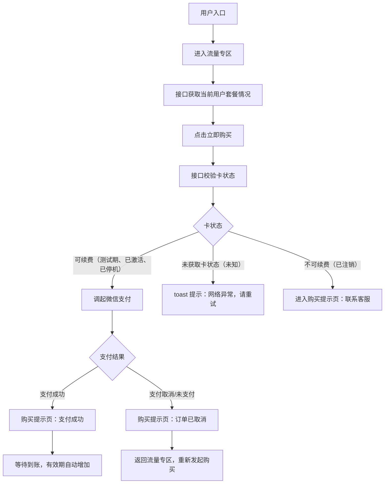
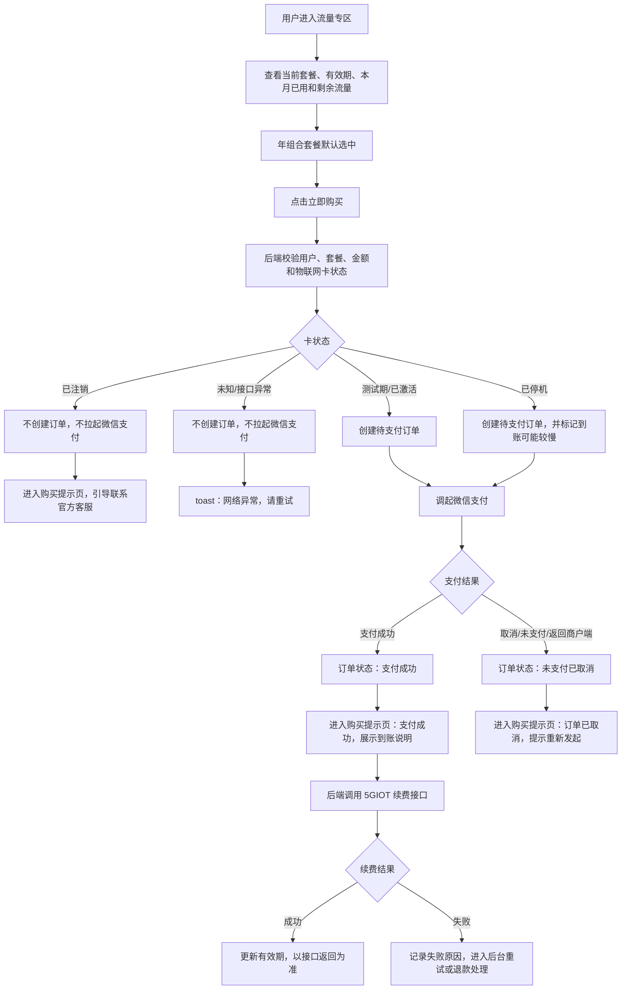
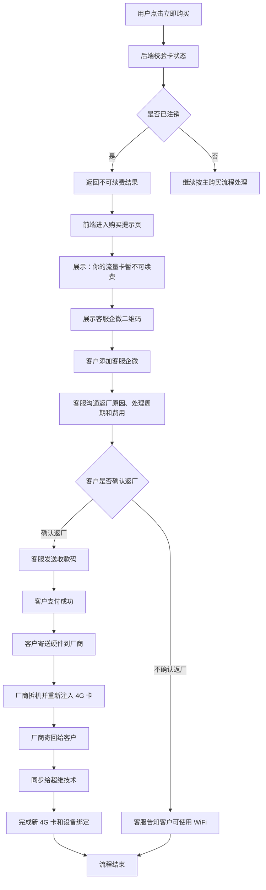
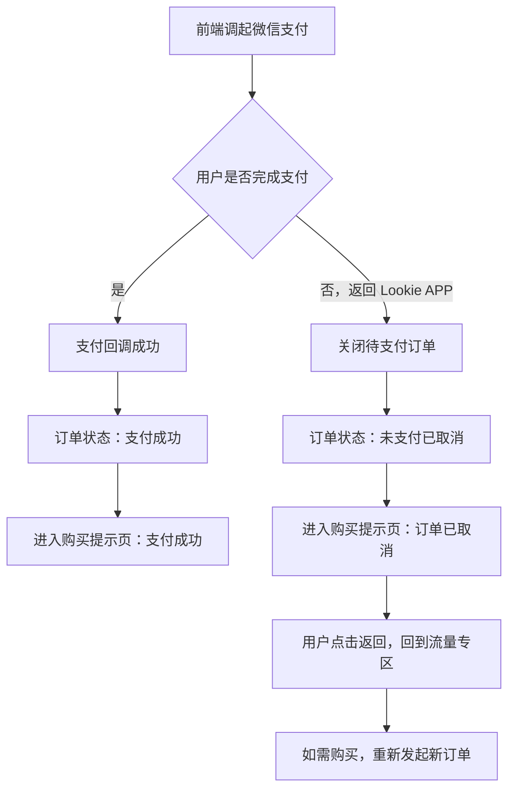

# 购买流量+AI算力功能需求

## 1. 背景

为已绑定 4G 物联网卡的用户提供流量与 AI 算力组合套餐购买能力。用户可在购买页查看当前套餐、流量使用情况、套餐有效期，购买年组合套餐并完成微信支付；支付成功后，系统异步执行 4G 流量续费，并在购买记录页展示订单。

本需求基于当前购买页原型、语雀《物联网卡管理后台介绍》和《物联网卡 API 接口文档》整理。第三方 5GIOT 接口本期使用物联网卡详情查询与物联网卡续费能力。本期仅实现年组合套餐，供应商仅支持年付费；月组合套餐、AI 算力年套餐待业务方燕敬和国荣确定策略后续再迭代。

## 2. 目标

- 用户能查看当前套餐、套餐有效期和本月流量使用情况。
- 套餐规划包含三类：年组合套餐、月组合套餐、AI 算力年套餐。本期仅做年组合套餐，其他两个待业务方燕敬和国荣确定好策略后续再迭代，供应商仅支持年付费。
- 用户能通过右上角入口进入购买记录页查看订单。
- 后端能完成年组合套餐支付、4G 流量续费和订单状态更新。

## 3. 页面范围

### 3.1 购买页

页面标题为 `流量专区`。

页头卡片展示：

- `当前套餐：组合套餐（4G流量+AI算力）`
- `套餐有效期至：2029-05-30`
- 本月已用流量：当前原型为 `本月已用流量 2.68 MB`
- 本月剩余流量：当前原型为 `本月剩余流量 1.00 GB`
- 查询时间提示：`查询时间2026-05-11 11:49:36　数据更新可能存在延迟`

购买区域标题为 `「购买流量+AI算力」`，居中展示。

可选套餐：

| 套餐 | 价格 | 文案 | 是否默认选中 |
| --- | --- | --- | --- |
| 组合套餐：4G流量+AI算力（年） | 79元/年 | 购买当月生效，连续12个月，每月1G流量和无限AI算力 | 是，展示推荐角标 |

说明：原型曾展示月组合套餐和 AI 算力年套餐，但本期不纳入实现范围；正式页面仅展示年组合套餐。若后续需要保留其他套餐位，只能标记为待开放或隐藏，不能进入下单和支付流程。

交互要求：

- 本期只有年组合套餐可购买，默认选中年组合套餐。
- 点击 `立即购买` 后，按年组合套餐发起购买。
- 交互方案已确认采用“正式页面不直接向用户展示底层卡状态，点击后由后端拦截”的方案；卡状态仅用于后端购买前校验。
- 备选方案为“页面展示卡状态，不可续费时 `立即购买` 按钮置灰不可点击”，本期不采用，避免把供应商底层限制直接暴露在用户端。
- 发起购买前必须校验物联网卡状态；卡状态为已注销时进入购买提示页的不可续费状态，未知状态 toast 提示 `网络异常，请重试`，均不创建订单、不拉起微信支付。
- 当前原型用于验证交互，在底部购买说明上方展示 `卡状态（仅展示交互，实际不展示）` 模拟切换模块；正式上线不展示该模块。
- 底部固定展示提示文案：
  - `购买后预计10分钟到账，高峰时段或套餐已过期会有延时`
  - `购买到账后有效期会自动增加`

### 3.2 支付模块

支付方式建议对接微信支付，具体技术方案由技术确认。

支付入口：

- 点击 `立即购买` 后，先完成套餐、金额、用户、物联网卡状态等购买前校验。
- 校验通过后，后端创建待支付订单，并返回前端调起微信支付所需参数。
- 校验不通过时，不创建待支付订单，不拉起微信支付。

未支付返回规则：

- 用户进入微信支付后未完成支付，返回 Lookie APP 后，视为订单取消，并进入购买提示页展示取消提示。
- 订单状态记录为 `未支付已取消`。
- 购买记录页不提供继续付款入口。
- 用户如需再次支付，需要重新在购买页发起购买。

购买提示页：

- 购买提示页用于承载支付成功、订单取消、不可续费三类结果；页面标题统一为 `购买提示`。
- 页面不使用卡片背景，整体样式与流量专区保持一致；主标题和提示文案使用黑色，操作入口为蓝色文字链接 `返回`。
- 支付成功状态展示绿色成功图标、标题 `支付成功` 和统一到账说明；提示文案下方展示文字链接 `返回`，点击返回流量专区页面。
- 支付成功状态到账说明统一展示：
  - `购买后预计10分钟到账，高峰时段或套餐已过期会有延时`
  - `购买到账后有效期会自动增加`
- 订单取消状态展示红色取消图标、标题 `订单已取消` 和 `未支付成功，订单已取消，请重新发起`；提示文案下方展示文字链接 `返回`，点击返回流量专区页面。
- 不可续费状态展示灰色提示图标、标题 `你的流量卡暂不可续费`、`请使用微信联系官方客服`、`在线时间早9:30-晚22:00` 和二维码占位符；提示文案下方展示文字链接 `返回`，点击返回流量专区页面。

技术待确认内容：

| 模块 | 待技术确认内容 |
| --- | --- |
| 支付产品形态 | App 内调起微信支付的接入方式，例如微信 App 支付、H5 支付或小程序支付；需结合当前 App 技术栈确定 |
| 下单接口 | 后端创建订单接口、套餐编码、金额校验、订单号生成规则和防重复提交策略 |
| 微信预支付 | 后端调用微信统一下单/预支付接口，返回前端调起支付所需参数 |
| 支付回调 | 微信支付异步通知地址、验签、回调幂等、重复通知处理和回调失败重试 |
| 支付结果查询 | 前端返回 App 后是否主动查询订单支付结果；后端是否提供订单状态轮询接口 |
| 取消和超时 | 用户进入微信后未支付返回 Lookie APP、支付超时、支付失败时如何关闭订单并展示 `未支付已取消` |
| 对账和退款 | 支付成功但 5GIOT 续费失败时，后台重试、人工补偿、退款流程和对账机制 |
| 安全和配置 | 微信商户号、AppID、API 证书、密钥、回调域名、环境隔离和日志脱敏 |

### 3.3 购买记录页

页面标题为 `购买记录`。

订单卡片展示字段：

- 订单ID
- 订单状态，仅展示 `支付成功`、`未支付已取消` 两种状态
- 订单时间
- 套餐名称，例如 `组合套餐：4G流量+AI算力（年）`
- 支付渠道，例如 `微信支付`
- 支付金额，例如 `79元/年`
- 支付成功订单展示付款时间，例如 `2026/06/25 18:24:50`
- 支付成功订单展示到账提示或到账状态说明
- 未支付已取消订单可展示取消原因，例如 `未支付`

点击购买页右上角购买记录图标进入购买记录页；点击购买记录页左上角返回按钮回到购买页。

## 4. 业务规则

### 4.1 套餐权益

本期仅支持年组合套餐：

- 页面说明文案：`购买当月生效，连续12个月，每月1G流量和无限AI算力`
- 购买成功后执行 4G 物联网卡年续费。
- 每月提供 1G 流量。
- 月组合套餐、AI 算力年套餐不在本期实现范围，不进入下单、支付和接口流程。

### 4.2 框架流程



### 4.3 卡状态校验

年组合套餐在创建订单和拉起微信支付前，必须先校验物联网卡状态。

| 后端卡状态 | 前端展示状态 | 处理规则 |
| --- | --- | --- |
| 测试期 | 正常使用，可续费 | 允许继续购买和续费 |
| 已激活 | 正常使用，可续费 | 允许继续购买和续费 |
| 已停机 | 已过期，可续费 | 允许继续购买和续费，到账可能存在延时 |
| 已注销 | 已注销，不可续费 | 无法续费成功，进入购买提示页的不可续费状态，不创建订单，不拉起微信支付 |
| 未知 | 未获取 | 后端获取卡状态异常，前端 toast 提示 `网络异常，请重试`；不创建订单，不拉起微信支付 |

4G 流量卡过期 20 天后会被注销，注销后无法继续续费。App 侧必须先做购买前控制，避免用户支付成功后再进入退款处理。

正式交互方案：

- 购买页不展示底层卡状态。
- `立即购买` 保持可点击；点击后由后端校验卡状态。
- 测试期、已激活、已停机继续进入支付流程。
- 已注销进入购买提示页。
- 未知或接口异常 toast 提示 `网络异常，请重试`。
- 当前原型展示 `卡状态（仅展示交互，实际不展示）` 模拟切换模块，仅用于验证以上分支。

### 4.4 文字版流程图

1. 用户进入购买页。
2. 后端根据登录用户查询绑定的设备和物联网卡 `iccid`。
3. 后端调用 5GIOT 详情接口获取流量使用情况和卡状态。
4. 前端展示当前套餐、有效期、流量使用情况和年组合套餐。
5. 用户点击 `立即购买`。
6. 后端校验物联网卡状态。
7. 若物联网卡状态为 `已注销`，返回不可续费结果，前端进入购买提示页，展示 `你的流量卡暂不可续费`、`请使用微信联系官方客服`、`在线时间早9:30-晚22:00`，并在下方展示二维码占位符；不创建待支付订单，不拉起微信支付。
8. 若物联网卡状态为 `未知` 或供应商接口异常，前端 toast 提示 `网络异常，请重试`；不创建待支付订单，不拉起微信支付。
9. 若物联网卡状态为 `测试期`、`已激活` 或 `已停机`，校验通过，系统创建待支付订单，并拉起微信支付。
10. 若用户进入微信支付但未完成支付，并返回 Lookie APP，订单状态记录为 `未支付已取消`，前端进入购买提示页展示 `订单已取消` 和 `未支付成功，订单已取消，请重新发起`，并在下方提供 `返回` 链接返回流量专区页面；购买记录页不提供继续付款入口，用户需要重新发起购买。
11. 微信支付回调成功后，订单状态记录为 `支付成功`，前端进入购买提示页展示 `支付成功` 和到账说明，并在下方提供 `返回` 链接返回流量专区页面，后端进入 5GIOT 续费处理。
12. 后端调用 5GIOT 续费接口，记录 `transactionNo`、成功卡号和失败原因。
13. 续费成功后更新套餐有效期；续费失败时进入后台重试机制，重试 X 次仍失败后按技术方案进入退款或人工处理。
14. 前端购买页刷新后展示新的套餐有效期；购买记录页展示订单。

### 4.5 购买详细流程

#### 4.5.1 主购买流程



#### 4.5.2 已注销不可续费流程



- 已注销卡无法在 App 端直接续费，前端进入购买提示页，引导用户联系官方客服。
- 客服兜底方向包括返厂换卡、重新写入实体贴片卡或由供应商/工厂完成新卡与设备重新绑定。
- 客服需向客户说明返厂原因、处理周期和费用；客户确认返厂后，由客服发送收款码并确认支付结果。
- 客户支付成功后寄送硬件到厂商，由厂商拆机并重新注入 4G 卡，处理完成后寄回给客户。
- 厂商完成新 4G 卡处理后，需同步给超维技术完成新 4G 卡和设备绑定。
- 客户不确认返厂时，客服告知客户可继续使用 WiFi。
- 若发生线下支付、维修、换卡或补偿，需在后台或运营台账中留痕，避免 App 订单系统与售后处理脱节。
- 是否支持远程恢复、换号、重新绑定和后续线上续费，仍需供应商和工厂确认。

#### 4.5.3 未支付取消流程



## 5. 订单状态

购买记录页只保留两种前台状态：

| 状态 | 说明 |
| --- | --- |
| 支付成功 | 微信支付已成功，订单已支付 |
| 未支付已取消 | 用户进入微信支付后未完成支付并返回 Lookie APP，或支付超时/取消 |

后台需保留更细的支付和续费记录，便于客服、对账和补偿处理：

| 后台字段 | 记录要求 |
| --- | --- |
| `payStatus` | 记录 `unpaid`、`paid` 等真实支付状态 |
| `displayStatus` | 映射到前台 `支付成功` 或 `未支付已取消` |
| `cancelReason` | 未支付返回 Lookie APP 时记录 `未支付` |
| `returnedAt` | 用户从微信支付返回 Lookie APP 的时间 |
| `renewalStatus` | 支付成功后的 5GIOT 续费状态，仅后台展示 |
| `failureReason` | 5GIOT 续费失败原因 |

### 5.1 到账规则

- 支付成功不等于流量续费已到账。
- 支付成功后订单进入续费处理中。
- 页面底部固定提示文案必须展示为：
  - `购买后预计10分钟到账，高峰时段或套餐已过期会有延时`
  - `购买到账后有效期会自动增加`
- 用户端统一展示到账说明，不按卡状态拆分不同文案。
- 后台可保留购买前卡状态，用于续费处理、客服判断和异常排查。
- 接口可能返回续费失败；续费失败时后端需记录失败原因并进入重试机制。
- 后端重试次数、重试间隔和最终失败后的退款策略由技术确认；建议重试 X 次后仍失败再进入退款或人工处理流程。

### 5.2 有效期处理

以下为供应商续费后的有效期处理原则，具体到期日不由 App 或我方业务侧自行计算：

- 购买到账后，系统自动增加套餐有效期。
- 若用户已有未过期套餐，原则上新购买套餐应在当前有效期基础上顺延。
- 若用户当前套餐已过期，原则上新购买套餐从到账时间开始计算。
- 展示给用户的套餐有效期直接读取 5GIOT 接口返回的 `expireDate` 字段。
- 如本地订单记录、续费记录与 5GIOT `expireDate` 不一致，用户端展示以 `expireDate` 为准，差异由后台记录并排查。

### 5.3 协议与退款原则

- 虚拟充值类权益支付成功且充值到账后，原则上不支持退款。
- 付费相关说明和服务协议已同步法务，后续需要补充购买页可见入口和协议确认流程。
- 文案需覆盖“一经充值不退款”等关键风险，但具体措辞以后续法务确认为准。

## 6. 接口接入

### 6.1 供应商接口文档

- [物联网卡管理后台介绍](https://www.yuque.com/doiot/5giot/znslan31vpl1cqap)
- [物联网卡 API 接口文档](https://www.yuque.com/doiot/5giot/frwyalet53k6y973)

### 6.2 鉴权

5GIOT 接口使用客户端 token 鉴权。

- 登录平台：`https://5giot.cn/`
- 操作路径：系统工具 -> 系统授权 -> 新增 -> 添加客户端 key -> 客户端密钥 -> 固定超时 -> 启用生效 -> 确定
- Header：

```http
Authorization: 客户端token
```

客户端 token 不允许下发到前端，必须由服务端保存和调用。

### 6.3 查询物联网卡详情

用于购买页展示流量状态和物联网卡有效期参考。

```http
GET https://5giot.cn/prod-api/open/iotCard/detail/info?iccid={iccid}
```

接口约束：

- 需要鉴权：是
- 接口限制：1s/次
- 请求参数：`iccid`，String，必传

主要响应字段：

| 字段 | 类型 | 用途 |
| --- | --- | --- |
| `iccid` | String | 物联网卡卡号 |
| `cardStatus` | String | 后端卡状态，可能为测试期、已激活、已停机、已注销、未知；前端按状态映射展示正常使用可续费、已过期可续费、已注销不可续费、未获取 |
| `expireDate` | String | 物联网卡过期时间 |
| `flowSpecification` | String | 流量规格 |
| `remainingVolume` | Double | 剩余流量 |
| `useDataVolume` | Double | 已用流量 |
| `totalDataVolume` | Double | 流量总量，单位 MB |
| `deviceStatusName` | String | 网络开启或关闭状态 |

前端展示建议：

- 本月已用 = `useDataVolume`
- 本月剩余 = `remainingVolume`
- 套餐有效期展示以 5GIOT `expireDate` 为准

### 6.4 物联网卡续费

用于年组合套餐的 4G 物联网卡续费。

```http
POST https://5giot.cn/prod-api/open/iotCard/applyForRenewal
```

请求体：

```json
{
  "iccidList": ["iccid1", "iccid2"]
}
```

接口约束：

- 需要鉴权：是
- `iccidList` 为必传 Array
- 接口文档说明：默认续费一年，无法更改

成功响应示例：

```json
{
  "code": 200,
  "msg": "开启成功",
  "data": {
    "transactionNo": "流水号",
    "money": 20.02,
    "memo": "备注",
    "suceessIccIdList": ["iccId1", "iccId2"],
    "errList": [
      {
        "iccIdList": ["未成功续费iccId1", "未成功续费iccId2"],
        "msg": "错误原因"
      }
    ]
  }
}
```

错误响应示例：

```json
{
  "code": 500,
  "msg": "系统错误"
}
```

注意：

- 接口返回字段为 `suceessIccIdList`，拼写需按第三方原字段兼容。
- 第三方接口返回的 `money` 是流量续费花费金额，不等同于用户支付订单金额。
- 续费接口错误响应中的 `系统错误` 属于支付后的后台续费失败场景，不作为购买前置卡状态校验 toast 直接透出；后端需记录失败原因，并通过后台重试、未成功续费按钮触发重试，或退款流程处理。
- 当前接口只支持默认续费一年，符合本期年组合套餐。

## 7. 异常处理

- 未绑定物联网卡：购买页展示空状态，不允许购买。
- 物联网卡已注销：点击 `立即购买` 时进入购买提示页，展示 `你的流量卡暂不可续费`、`请使用微信联系官方客服`、`在线时间早9:30-晚22:00`，并在下方展示二维码占位符；不创建订单，不拉起微信支付。
- 物联网卡状态未知：后端获取卡状态异常，点击 `立即购买` 时 toast 提示 `网络异常，请重试`；不创建订单，不拉起微信支付。
- 5GIOT 详情查询失败：展示本地缓存数据或提示“数据更新可能存在延迟”。
- 5GIOT 续费失败：订单保留支付成功状态，同时记录续费失败原因，进入补偿队列；后端可自动重试，也可由后台“未成功续费”按钮触发重试，重试 X 次后仍失败再进入退款或人工处理流程。
- 部分 ICCID 续费失败：以 `errList` 记录失败卡号和原因。
- 微信支付失败、取消、超时，或进入微信支付后未支付即返回 Lookie APP：购买记录页展示 `未支付已取消`，后台记录取消原因 `未支付`，不执行 5GIOT 续费。

## 8. 数据字段

订单字段：

- `orderId`：订单 ID
- `userId`：用户 ID
- `packageCode`：套餐编码，本期仅年组合套餐
- `packageName`：套餐名称
- `amount`：用户实付金额
- `payChannel`：支付渠道，当前为微信支付
- `payStatus`：支付状态
- `displayStatus`：购买记录页展示状态，仅 `支付成功` 或 `未支付已取消`
- `cancelReason`：取消原因，未支付返回 Lookie APP 时记录 `未支付`
- `returnedAt`：从微信支付返回 Lookie APP 的时间
- `renewalStatus`：续费状态，仅后台使用
- `paidAt`：付款时间
- `createdAt`：下单时间

套餐字段：

- `iccid`：物联网卡号
- `trafficMonths`：流量续费月数，本期为 12
- `effectiveAt`：生效时间
- `expireAt`：有效期截止时间展示快照，取自 5GIOT `expireDate`

第三方续费记录字段：

- `transactionNo`：5GIOT 流水号
- `thirdPartyMoney`：5GIOT 续费花费金额
- `successIccIdList`：续费成功卡号列表，兼容第三方 `suceessIccIdList`
- `errList`：续费失败列表
- `retryCount`：后端续费重试次数
- `lastRetryAt`：最近一次重试时间
- `finalFailureReason`：重试后仍失败的最终失败原因

## 9. 验收标准

- 购买页可正确展示当前套餐、有效期、流量使用情况和查询时间。
- 本期仅年组合套餐可购买，默认选中年组合套餐并展示推荐角标。
- 购买页底部固定展示 `购买后预计10分钟到账，高峰时段或套餐已过期会有延时`、`购买到账后有效期会自动增加`。
- 点击立即购买时，先按年组合套餐做购买前校验；校验通过后再创建订单。
- 创建订单前需校验物联网卡状态；`测试期`、`已激活`、`已停机` 可继续购买，`已注销` 时进入购买提示页的不可续费状态，`未知` 时提示 `网络异常，请重试`，均不展示微信支付框。
- 支付模块方案需完成技术确认，包括微信支付接入方式、下单接口、支付回调、状态查询、取消超时、退款和对账机制。
- 支付成功和订单取消不使用 toast，均跳转购买提示页展示结果和友好提示。
- 支付成功后，购买记录页能展示订单 ID、套餐、微信支付、金额和付款时间。
- 进入微信支付但未支付并返回 Lookie APP 时，购买记录页展示 `未支付已取消`，后台取消原因记录为 `未支付`，且不提供继续付款入口。
- 年组合套餐支付成功后，后端能调用 5GIOT 续费接口，并记录 `transactionNo`。
- 购买提示页的支付成功状态统一展示到账说明，不按正常使用卡和已停机卡拆分不同文案。
- 5GIOT 续费失败时，订单能保留失败原因并进入后台重试；重试 X 次后仍失败时按技术方案进入退款或人工处理。

## 10. 待确认

### 10.1 支付、订单与退款

- 支付模块技术方案待确认：微信支付接入方式、商户配置、下单接口、回调验签、订单状态查询、取消超时、退款和对账机制。
- 首期支付方式是否只接微信支付，还是同步支持支付宝，需技术和业务确认。
- 后端续费失败后的重试次数、重试间隔、最终失败退款策略需技术确认。
- 支付成功但 5GIOT 续费失败时，后台需保留失败原因，并确定自动重试、人工重试、退款和对账的处理边界。
- 付费相关说明和服务协议已同步法务，后续再补充页面入口与协议确认流程。
- 虚拟充值类权益支付成功且充值到账后原则上不支持退款，具体文案和协议位置待法务确认。

### 10.2 套餐与有效期

- 月组合套餐、AI 算力年套餐待业务方燕敬和国荣确定策略后续再迭代。
- 供应商按年付且购买当月生效，用户端体验较差，可能存在只使用 1 天也计为 1 个月的情况。
- 供应商是否能支持按天计算有效期、购买后补足 13 个月、从用户首次真实使用开始计算，或对历史库存机额外赠送有效期。
- 当前套餐有效期展示以 5GIOT `expireDate` 接口返回为准；我方不自行计算具体到期日，如本地订单记录与接口返回不一致，需以接口返回优先并记录差异。

### 10.3 卡状态与供应商能力

- 是否在 App 明确提示“4G 流量卡过期 20 天后注销且不可续费”：明说能提醒用户及时续费，但会暴露底层卡规则；当前购买提示页的不可续费状态采用客服引导文案，不直接说明过期 20 天规则。
- 4G 流量卡过期 20 天即注销、后续不可续费的问题已同步燕敬；App 侧先做购买前控制，避免支付成功后再退款。
- 供应商是否有“超过停机 20 天后仍可恢复使用”的方案。
- 供应商是否支持远程重新开通、保号、换新号、重新写号或重新绑定，而不是必须返厂。
- 供应商卡状态枚举是否完整；如存在测试期、沉默期、激活中、异常等更多状态，需补充前端分支和后端映射。

### 10.4 激活、设备绑定与历史补偿

- 卡的激活定义待确认：工厂贴卡、工厂测试、固件首次联网、用户首次开机、测试期结束或沉默期结束，分别是否触发正式激活。
- 工厂测试是否会提前消耗套餐有效期，固件是否需要避免测试阶段误触发正式激活。
- 供应商后台是否有设备、MAC、号码、卡的一对一绑定关系。
- 返厂换卡后，新卡是否能绑定回原设备，App 是否能通过原设备信息获取新卡状态。
- 历史用户和库存机如果因出厂或测试提前激活导致有效期损耗，是否通过 Excel 清单、脚本或后台批量补偿。

### 10.5 客服与售后兜底

- 已注销用户的客服入口放官方微信、企微、电商客服、邮箱还是其他渠道，需运营确认。
- 线下支付、维修、返厂、换卡或补偿如何在后台或运营台账中留痕，避免与 App 订单系统脱节。
- 返厂换卡后的物流、拆机、壳体、人工和卡费成本是否能被 79 元年组合套餐覆盖，需业务测算。
